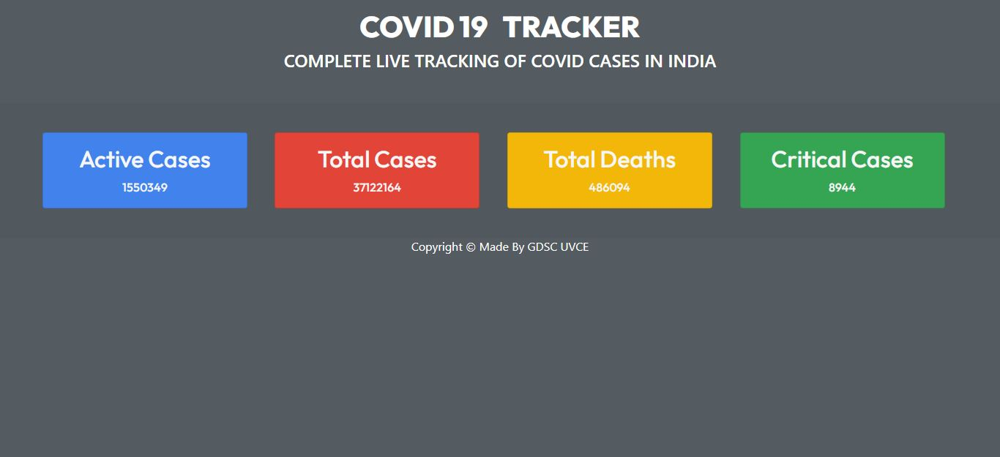
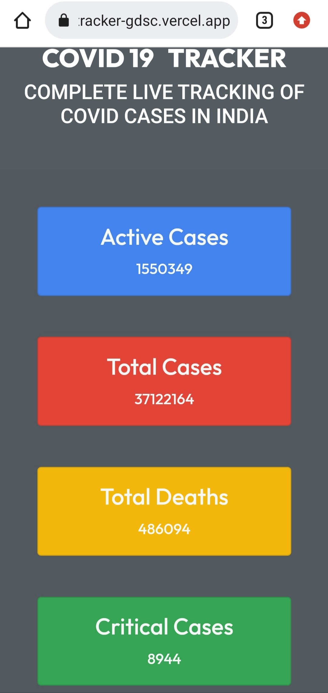

# Simple Web For COVID Tracking 

### Tech Used
1. HTML - [Click Here](../master/index.html)
2. CSS - [Click Here](../master/index.css)
3. JS - [Click Here](../master/index.js)
4. Basic Free Covid Tracking API
<br> API   :point_down:
```
https://corona.lmao.ninja/v2/countries/india
```


## Logic Used 
  API fetch and display logic

## Repo Clone :point_down: :hearts:
&nbsp; To Clone This Repo Use This Command On Your Git Bash Shell
```
git clone https://github.com/pradeep15a/covid-19-tracker.git
```

## ScreenShots
Click on the images for the website
### Desktop View
<p align="center"> 
    <a href="https://covid-19-tracker-gdsc.vercel.app/" target="_blank"> 
    </a>
</p>

### Mobile View
<p align="center">
    <a href="https://covid-19-tracker-gdsc.vercel.app/" target="_blank"> 
    </a>
</p>


## Credits 
© TECH - TEAM GDSC-UVCE 
<br>&nbsp;&nbsp;&nbsp; (Web Magic)

Instagram - [@dsc.uvce](https://www.instagram.com/dsc.uvce/)
